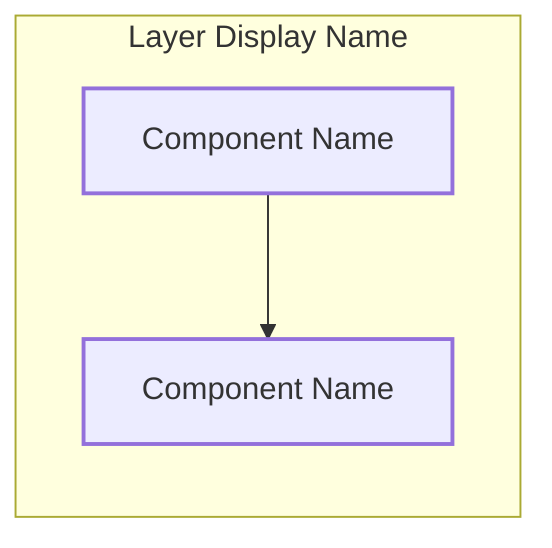

# Documenting System Architecture

## Overview

Create clear, professional system architecture diagrams by following a structured approach: explore the codebase to identify components, apply standard layer definitions, and render Mermaid diagrams with proper syntax.

## When to Use

**Symptoms:**
- New codebase with unclear component relationships
- Need to document architecture for team or future reference
- Existing diagrams are ASCII art or outdated

**Trigger:**
- User asks to "document architecture", "create architecture diagram", "梳理架构"
- Starting work on unfamiliar codebase

## The SOP for Architecture Diagrams

### Phase 1: Explore and Identify Components

1. **List all source files** - Find main packages and their responsibilities
2. **Identify key interfaces** - Look for Port/Interface definitions
3. **Trace data flows** - Follow requests from entry to exit
4. **Map external dependencies** - Databases, caches, message queues, external services

**Key search patterns:**
```
# Go projects
- "type.*Port interface" - Port interfaces
- "func New.*Service" - Service constructors
- "struct.*Adapter" - Adapter implementations
- "wire.*Provide" - Dependency injection

# All projects
- "TODO" / "FIXME" patterns
- Configuration files
- Entry points (main.go, index.js)
```

### Phase 2: Define Layer Structure

Standard technology architecture layers (top-to-bottom):

| Layer | Purpose | Examples |
|-------|---------|----------|
| **Client/Frontend** | User-facing applications | Web, App, SDK |
| **Gateway** | Request routing, auth | API Gateway, Nginx, Kratos |
| **Application** | Business orchestration | UseCase, Service, Controller |
| **Agent/Core** | Core processing logic | AI Agents, Processors |
| **Middleware** | Async messaging | Kafka, RabbitMQ, Redis Pub |
| **Data** | Persistence & cache | MySQL, Redis, External APIs |
| **Infrastructure** | Runtime environment | Docker, K8s, Cloud services |

### Phase 3: Draw Mermaid Diagram

**Correct Mermaid syntax:**


**Common errors to avoid:**
- ❌ Nested subgraphs without labels: `subgraph ""`
- ❌ Quoted link labels: `|"|label"|"`
- ❌ Mixed syntax in same diagram

### Phase 4: Document Core Flows

Add numbered steps showing data movement:

```
1. Request ────► Gateway
2. Gateway ───► Application Service
3. Service ───► Domain Logic
4. Domain ────► External Service
5. Response ◄─── Service
```

## Quick Reference

### Layer Color Scheme

| Layer | Fill Color | Border Color |
|-------|------------|--------------|
| Client | #e3f2fd (blue) | #1565c0 |
| Gateway | #f3e5f5 (purple) | #7b1fa2 |
| Application | #e8f5e9 (green) | #2e7d32 |
| Agent/Core | #fff3e0 (orange) | #e65100 |
| Middleware | #fce4ec (pink) | #c2185b |
| Data | #f1f8e9 (light green) | #558b2f |
| Infrastructure | #f5f5f5 (gray) | #616161 |

### Mermaid Subgraph Template

```mermaid
subgraph LAYER["Layer Name"]
    direction TB
    C1["Component 1"]
    C2["Component 2"]
end
```

### Common Search Commands

```bash
# Find interfaces
grep -r "interface {" --include="*.go" | head -20

# Find service implementations
grep -r "func New" --include="*.go" | grep -v test

# Find dependencies
grep -r "import (" -A 20 --include="*.go" | head -30
```

## Implementation

### Step 1: Explore Codebase

Use Agent tool with Explore subagent type:

```
Task: Explore [project path] to understand system architecture

Focus on:
1. Find all service/agent/port definitions
2. Identify how components communicate
3. Find data storage and caching layers
4. Map external dependencies
```

### Step 2: Create Architecture Document

Save to: `docs/plans/YYYY-MM-DD-<topic>-architecture.md`

Include:
1. **Mermaid Diagram** - Visual representation
2. **Layer Table** - Layer definitions with components
3. **Core Flows** - Numbered data flow steps

### Step 3: Validate Diagram

- Test Mermaid syntax renders correctly
- Verify all components from exploration are represented
- Check data flows are accurate

## Common Mistakes

| Mistake | Why It's Bad | Fix |
|---------|--------------|-----|
| ASCII art diagrams | Hard to maintain, doesn't render well | Use Mermaid |
| Missing layers | Incomplete picture | Follow SOP |
| No color coding | Hard to distinguish layers | Apply color scheme |
| No data flow | Shows structure not behavior | Add numbered steps |
| Nested subgraphs without names | Syntax error | Always label subgraphs |

## Real-World Impact

Good architecture documentation:
- Reduces onboarding time for new team members
- Enables better technical decisions
- Supports incident response and debugging
- Creates institutional knowledge

**Example:** The cw2-live-chat-casa architecture document now shows:
- 7 distinct layers from Client to Infrastructure
- Agent routing flow with Supervisor + 5 sub-agents
- Context loading from Redis (History + GlobalContext)
- Async message publishing via Kafka
