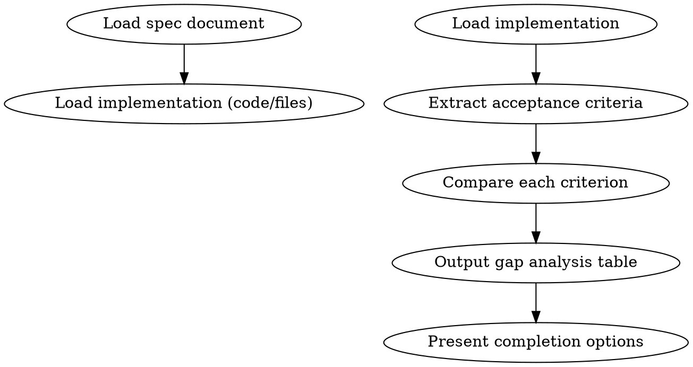

# Spec-Verified Implementation

## Overview

Verify implementation against a specification document and output a comparison table showing gaps. This skill is for **gap identification only** — it does NOT create remediation plans or execute fixes.

**Core principle:** Tests pass ≠ spec is satisfied. Identify gaps without fixing them.

## When to Use

**Use when:**
- User says "implement Phase 1" or "complete feature X" with a spec document
- Claims like "80% complete" or "feature is done" are made without reference to spec
- A spec document exists that defines the target state
- User asks to "check if we've implemented [spec]"

**Don't use when:**
- No spec document is available (ask user for spec first)
- Writing a one-off script with no spec (use direct implementation)
- User asks to fix gaps (this skill only identifies gaps)

## The Workflow



## Step 1: Load Spec Document

User provides spec path or URL. Load and read it:
- What must be implemented?
- What are the acceptance criteria?
- What is explicitly out of scope?

## Step 2: Load Implementation

Read the relevant code files, configuration, or documentation that implements the spec.

## Step 3: Extract Acceptance Criteria

List each acceptance criterion from the spec. These become the rows of your comparison table.

## Step 4: Compare Each Criterion

For each acceptance criterion:
- Does the implementation satisfy this criterion?
- Does evidence (grep result, file:line, or explanation) support the assessment?

## Step 5: Output Gap Analysis Table

Present the comparison in this format:

```
## Spec Compliance Gap Analysis

| 文档要求 | 当前状态 | 差距分析 | 结论 |
|---------|---------|---------|------|
| [从spec来的要求] | [代码实际做了什么] | [缺少什么或有什么错误] | SATISFIED / NOT SATISFIED |
```

**For each row:**
- 文档要求: 直接引用 spec 中的 acceptance criterion
- 当前状态: 代码实际实现的内容，用 grep 结果或文件:行号 支持
- 差距分析: 缺失内容、错误实现、或多余实现的具体描述
- 结论: `SATISFIED` 或 `NOT SATISFIED`

**Important:** This table shows gaps, NOT fixes. Do not include remediation steps here.

## Step 6: Summary

After the table, provide a brief summary:

```
## Summary

Total criteria: N
Satisfied: X
Not satisfied: Y

[If Y > 0]: The following items require attention:
- [List NOT SATISFIED criteria by name/number]
```

## Step 7: Present Options

```
Spec verification complete. What would you like to do?

1. Fix the gaps identified above
2. Update the spec if requirements have changed
3. Keep as-is (acknowledge gaps but no action)
4. Merge/create PR with current state

Which option?
```

## Common Mistakes

| Mistake | Why It's Wrong | Prevention |
|---------|---------------|------------|
| "Tests pass, we're done" | Tests ≠ spec verification | Verify each acceptance criterion |
| Only checking what exists | Forgot to check spec requirements | Use table structure for all criteria |
| Mixing verification with fixing | Scope creep, unclear output | Gap analysis = identification only |
| Vague gap descriptions | Can't act on findings | Use specific file:line references |

## Red Flags - STOP

- Presenting fixes without user asking
- Skipping the table format
- "Tests pass, we're done" as conclusion
- No evidence (grep/file:line) for claims
- Claiming SATISFIED without showing implementation

**All of these mean: You haven't properly verified against spec.**

## Quick Reference

**Verification checklist:**
- [ ] Spec document loaded
- [ ] Implementation code/files loaded
- [ ] All acceptance criteria listed
- [ ] Gap analysis table completed (4 columns)
- [ ] Each SATISFIED has evidence
- [ ] Each NOT SATISFIED has specific gap description
- [ ] Summary with counts
- [ ] Options presented

**Table format:**
```
| 文档要求 | 当前状态 | 差距分析 | 结论 |
|---------|---------|---------|------|
```
